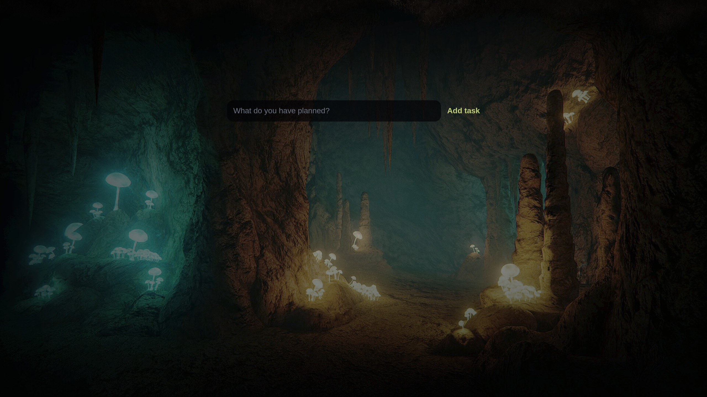
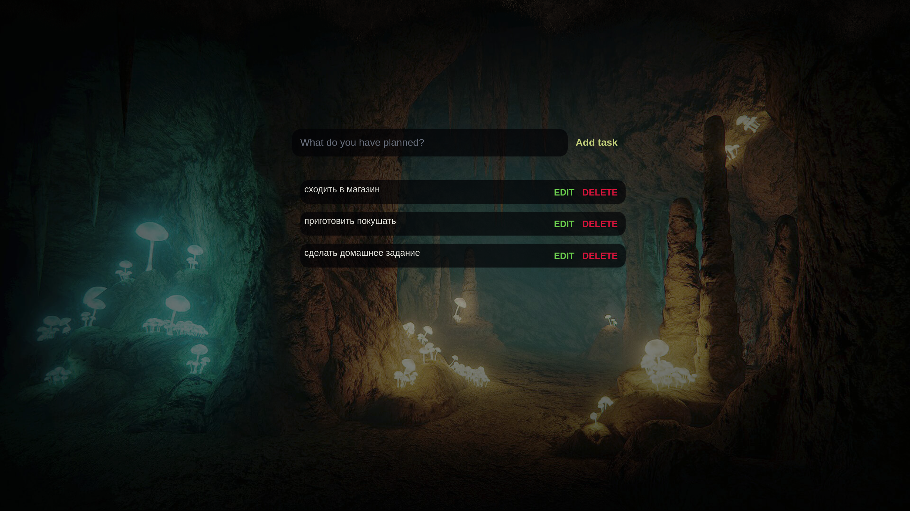

# SchoolProject 

# Описание проекта

Это школьный проект представляет собой веб-приложение для управления задачами. Пользователи могут добавлять, редактировать и удалять задачи, которые сохраняются в локальном хранилище браузера.

## Функционал
- Добавление новых задач.
- Редактирование существующих задач.
- Удаление задач.
- Сохранение задач в локальном хранилище браузера (LocalStorage).
- Адаптивный интерфейс.

## Скриншоты

- Главный экран сайта: 
- Добавление задачи: 
- Список задач: 
- Изменение задач: 

## Установка
1. Склонируйте репозиторий:
   ```bash
   git clone https://github.com/MaksimUlitin/SchoolProject.git
   ```
2. Перейдите в папку проекта:
   ```bash
   cd schoolProject
   ```
3. Откройте файл `index.html` в браузере.

## Структура проекта
```
.
├── css
├── fonts
├── img
├── js
├── libs
│  └── gsap
└── screenshots


```


## Используемые технологии
- HTML5
- CSS3
- JavaScript (ES6+)
- LocalStorage
- GSAP (анимации)

 
  
